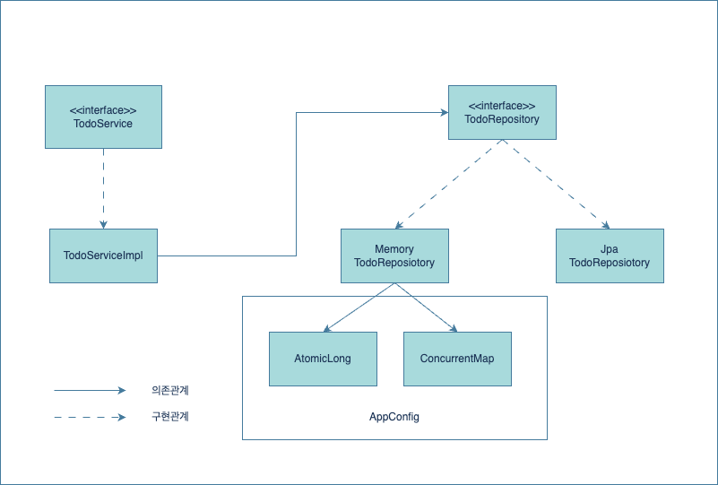

## Todo Design

### Todo 도메인 설계

#### 도메인 요구사항
1. 할 일 도메인은 다음 필드를 갖는다.
    - 제목
    - 내용
    - 완료 여부
2. 클라이언트는 할 일을 등록 할 수 있다.
3. 클라이언트는 할 일을 수정 할 수 있다. (제목, 내용, 완료 여부)
4. 클라이언트는 할 일을 삭제 할 수 있다.
5. 클라이언트는 할 일 한 건을 조회할 수 있다.
6. 클라이언트는 할 일의 전체 목록을 조회 할 수 있다.

#### 주요 구현 요구사항

1. 봉투 패턴을 구현한다.
2. 전역적인 에러 처리를 구현한다.
3. 초기에는 in-memory 저장소를 이용한다.
4. 이후 RDB를 사용하여 도메인을 영속화 한다.

#### 요구사항에 따른 클래스 / Bean 다이어그램
